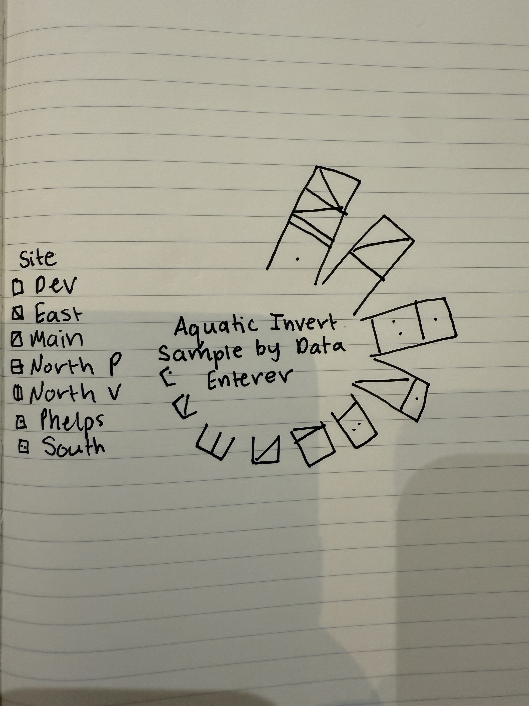

# Set Up


## Packages 
```{r}
#| label: Packages
#| message: false

# general use and cleaning

library(tidyverse)
library(here)
library(janitor)
library(NatParksPalettes)


# reading in .xlsx files
library(readxl)

```

## Data

```{r}

# site information
sites <- read_xlsx(
  here("data", "Aquatic Sampling Data-2026-03-10.xlsx"),
  sheet = "sites")

#survey data
aq_ins <- read_xlsx(
  here("data", "Aquatic Sampling Data-2026-03-10.xlsx"),
  sheet = "Aquatic Insects")

```
## Cleaning sites
```{r}

# creating new object from sites
ncos_sites <- sites |> 
  # filtering to only include NCOS quarterly sites
  filter(sector == "NCOS" & 
           sampling_frequency == "Quarterly")

```


## Cleaning aq_ins
```{r}
#| label: cleaning_aquatic_insects

# create a new object
aq_ins_clean <- aq_ins |>
  # only including columns of interest
  select(`Person Entering Data`, Site) |> 
  # clean column names
  clean_names() |> 
  semi_join(ncos_sites, by = "site") |> 
  mutate(site_full = case_when(
    site == "NVBR" ~ "North of Venoco Bridge",
    site == "NEC" ~ "East Channel",
    site == "NMC" ~ "Main Channel",
    site == "NPB" ~ "South of Phelps Bridge",
    site == "NPB1" ~ "North of Phelps Bridge",
    site == "NPB2" ~ "Phelps Road",
    site == "NWP" ~  "West Pond",
    site == "NDC" ~ "Devereux Creek")) |> 
  filter(!is.na(person_entering_data), !is.na(site_full))


```

# Problems 

## 1. Explain Your Inspiration

- I chose Cristina Cametti’s “IKEA most popular designers” visualization for my inspiration. 

- This made sense for the `aq_ins_clean` dataset because the ikea visualization was the comparison of two categorical variables, which `aq_ins_clean` has. The usage of designers in the ikea visualization inspired me to use information from a column which we haven used before - Data Enterer. 

- The variables being shown from the `aq_ins_clean` dataset are `person_entering_data` and `site_full`. The person entering data will be represented by one bar and the colors making up the bar (and the relative sizes of these colors) will represent the site that observation came from and the number of samples entered. 

## 2. Plan Your Figure

## 3. Code Your Figure - TidyTuesday 03/11/2020 - IKEA Furniture

### Wrangling
```{r}
#| label: wrangling

# create new object from `aq_ins_clean`
dt <- aq_ins_clean |>
  # group by person and site
  group_by(person_entering_data, site_full) |> 
  # count how many times each person/site combination appears
  tally() |> 
  # ungroup data 
  ungroup() |> 
  # re-group by just person so we can calculate each person's total count
  group_by(person_entering_data) |> 
  # add a new column that sums all entries for each person
  mutate(total = sum(n)) |> 
  # ungroup data frame
  ungroup() |> 
  # keep only people who have entered data 2 or more times total 
  # (keep from overcrowding)
  filter(total >= 2) |> 
  # sorting rows from highest to lowest total entries
  arrange(desc(total)) |> 
  # reorder the person factor levels by total count so the plot 
  # displays in order
  mutate(person_entering_data = fct_reorder(person_entering_data, total, .desc = TRUE),
          # convert site to a factor so ggplot can use it for colors
         site_full = as.factor(site_full))

```

### Angle/Label Calculations
```{r}
#| label: calculating-angle-label

# one row per person for angle/label calculations
# creating new object from wrangled `dt`
label_data <- dt |> 
  # group by person
  group_by(person_entering_data) |> 
    # keep only the first value of "total" for each person 
    # (they are all the same)
  summarize(total = first(total)) |> 
  # sort by total so label positions match bar positions
  arrange(desc(total)) |> 
  # create a new column for giving each person a number 1 through n 
  # representing their position in the circle
  mutate(id = row_number())


# counting how many bars there will be total
number_of_bar <- nrow(label_data)

# calculate the angle each label should be rotated based on its 
# position in the circle
# 90 degrees starts the circle at the top; dividing by number of bar 
# spaces them evenly
angle <- 90 - 360 * (label_data$id - 0.5) / number_of_bar

# labels on the left side of the circle get right-aligned (hjust = 1)
# labels on the right side get left-aligned (hjust = 0)
# this keeps all labels pointing away from the center
label_data$hjust <- ifelse(angle < -90, 1, 0)

# labels on the left side of the circle get flipped 180 degrees
# so they don't appear upside down
label_data$angle <- ifelse(angle < -90, angle + 180, angle)
```

### Plotting
```{r}
# plot

# base layer ggplot using the `dt` data
p <- ggplot(dt) +
  # draw a stacked bar for each person, with each site shown as a 
  # different color segment
  # position = "stack" places site segments on top of each other 
  # within one bar per person
  geom_bar(aes(x = person_entering_data, y = n, fill = site_full),
           stat = "identity", position = "stack") +
  # set the y-axis range: the negative value (-10) creates the hollow 
  # space in the center
  # the upper value adds room above the tallest bar for labels
  ylim(-10, max(label_data$total, na.rm = TRUE) + 5) +
  # taking away graph outline
  theme_minimal() +
  # adding in custom color palette
  scale_fill_manual(values = natparks.pals("DeathValley"), name = "Site") +
  theme(
    # hide the axis tick numbers and labels
    axis.text = element_blank(),
    # hide the axis titles (x and y labels)
    axis.title = element_blank(),
    # remove all background grid lines
    panel.grid = element_blank(),
    # use negative margins so the circular plot fills as much space 
    # as possible
    plot.margin = unit(rep(-1, 4), "cm")
  ) +
  # place a text title in the hollow center of the circle
  # x = 0 centers it, y = -10 places it in the hollow area below zero
  annotate(geom = "text",
           x = 0, y = -8,
           hjust = .5, vjust = 1,
           label = "NCOS Aquatic\nInvertebrate Samples\nby Data Enterer",
           size = 2.5, lineheight = 0.8,
           color = "black") +
   # transform the bar chart from a straight layout into a circle
  coord_polar(start = 0) +
    # add each person's name as a rotated label just beyond the tip 
    # of their bar
  geom_text(data = label_data,
            aes(x = person_entering_data, 
                # place label just above the top of the bar
                y = total + 1,
                label = person_entering_data,
                # use the left/right alignment calculated earlier
                hjust = hjust),
            color = "black", fontface = "bold", alpha = 0.6, size = 3,
            # rotate each label to follow the curve of the circle
            angle = label_data$angle,
            # don't inherit the x/y aesthetic from the main ggplot() call
            inherit.aes = FALSE)
# displaying plot
p

```

## 4. Describe Your Process

- Using someone else's code to create a visualization was overwhelming in the beginning. I had to not only try to understand the methodology used in terms of functions and arguments, but also had to take a dive into the data frame used to understand the structure of observations (rows and columns) to inform how the code was able to work. 

- This visualization relies on a lot of mathematical components, like calculating the angle for positioning around a circle and using coordinates to place figure components in exact locations, that I never would have thought to be necessary in the creation of this visualization. It was hard for me to keep my patience in this assignment. I saw the figure that I wanted to make, but didn't expect just how many small pieces it would take to build up to it. It really helped me to run everything line by line to conceptualize what each function was achieving and to really see how the plot comes together with each step. 

- This visualization differs from anything that we have made in class, assignments, or electives as it alters the shape of the base ggplot to create a unique and intriguing conceptualization of data that otherwise may seem a bit boring and monotonous. It also differs slightly from the inspiration by stacking all of the observations for a single person (across sites) into one bar, rather than having separate bars for each person per site. I felt that this better displayed the information that I was interested in, which is which of the NCOS volunteer students entered the most amount of data and which sites were those observations from. I enjoyed getting to play around with the visualization capabilities of R studio, even though it was a bit confusing and frustrating at times.  


